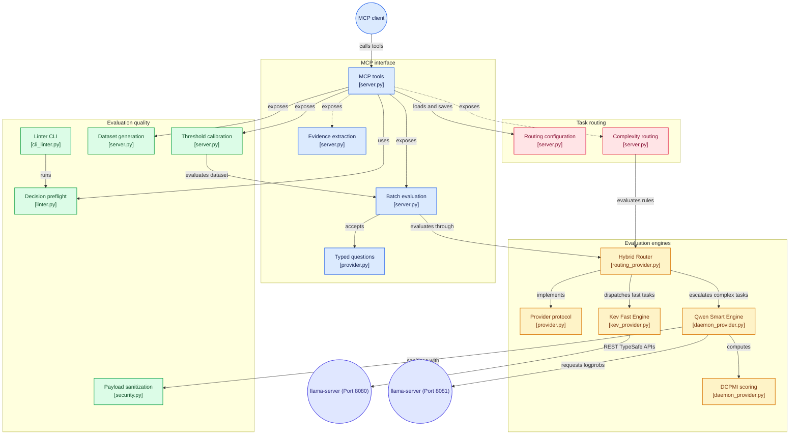

# Jev MCP: The Dual-Engine Intelligence Router

Jev MCP is a high-performance, mathematically rigorous FastMCP server designed for macOS Apple Silicon. It replaces slow, error-prone generative API calls by wrapping two local AI models in a unified **Dual-Engine Architecture**.

Instead of asking a cloud LLM to blindly generate text for routing or classification, Jev runs a hybrid local pipeline:
1. **The Fast Engine (Kev 0.8B):** Instantly intercepts simple boolean, multiple-choice, and multi-agent routing logic. By utilizing a native pointer-head to extract raw mathematical probability distributions (logit extraction) without generating text, it subtracts statistical bias and yields calibrated confidence scores in roughly 40 ms per warm request (see [Performance Benchmarks](#-performance-benchmarks)) that you can threshold (use `calibrate`) to trade automation rate against precision.
2. **The Smart Engine (Qwen2.5 7B):** When tasks require deep inferential reasoning, synthetic edge-case generation, or massive context compression, Jev dynamically escalates the request to a powerful 7B reasoning model running on Apple's `mlx_lm` C++ backend.

By combining the strict mathematical safety of Kev with the reasoning depth of Qwen, Jev provides your downstream MCP clients (like Claude Desktop or Antigravity) with the ultimate local safety gate and dynamic task router.

```mermaid
%% Generated by https://gitdiagram.com/eepstein201/jev-mcp
flowchart TD

subgraph group_entry["MCP Entry"]
  node_server["MCP Tool Server<br/>[server.py]"]
  node_lint["Decision Linter<br/>[linter.py]"]
  node_cli["Linter CLI<br/>[cli_linter.py]"]
end

subgraph group_routing["Evaluation Engines"]
  node_question["Typed Questions<br/>[provider.py]"]
  node_router["Hybrid Router"]
  node_kev["Kev Provider<br/>[kev_provider.py]"]
  node_daemon["Smart Daemon Provider<br/>[daemon_provider.py]"]
  node_provider["Provider Contract<br/>[provider.py]"]
end

subgraph group_repo["Repository Tools"]
  node_scanner["Repository Scanner<br/>[scanner.py]"]
  node_chunker["Semantic Chunker<br/>[chunker.py]"]
end

subgraph group_safety["Policy and Configuration"]
  node_security["Payload and Path Safety<br/>[security.py]"]
  node_config[("Router Configuration<br/>[router_config.py]")]
end

node_client(("MCP Client"))
node_fastservice["Kev Local Service"]
node_smartservice["Local LLM Service (llama.cpp)"]

node_client -->|"calls tools"| node_server
node_server -->|"evaluates"| node_router
node_router -->|"evaluates first"| node_kev
node_router -->|"escalates uncertain"| node_daemon
node_kev -->|"posts evaluations"| node_fastservice
node_daemon -->|"posts evaluations"| node_smartservice
node_kev -->|"uses contract"| node_provider
node_daemon -->|"uses transport"| node_provider
node_router -->|"implements contract"| node_provider
node_server -->|"checks prompts"| node_lint
node_cli -->|"runs lint"| node_lint
node_server -->|"scans repositories"| node_scanner
node_server -->|"extracts code chunks"| node_chunker
node_server -->|"sanitizes and guards paths"| node_security
node_server -->|"manages router settings"| node_config
node_daemon -->|"loads temperature"| node_config
node_daemon -->|"sanitizes payloads"| node_security
node_kev -->|"sanitizes payloads"| node_security

click node_server "https://github.com/eepstein201/jev-mcp/blob/main/src/jev_mcp/server.py"
click node_question "https://github.com/eepstein201/jev-mcp/blob/main/src/jev_mcp/provider.py"
click node_router "https://github.com/eepstein201/jev-mcp/blob/main/src/jev_mcp/routing_provider.py"
click node_kev "https://github.com/eepstein201/jev-mcp/blob/main/src/jev_mcp/kev_provider.py"
click node_daemon "https://github.com/eepstein201/jev-mcp/blob/main/src/jev_mcp/daemon_provider.py"
click node_lint "https://github.com/eepstein201/jev-mcp/blob/main/src/jev_mcp/linter.py"
click node_cli "https://github.com/eepstein201/jev-mcp/blob/main/src/jev_mcp/cli_linter.py"
click node_scanner "https://github.com/eepstein201/jev-mcp/blob/main/src/jev_mcp/scanner.py"
click node_chunker "https://github.com/eepstein201/jev-mcp/blob/main/src/jev_mcp/chunker.py"
click node_security "https://github.com/eepstein201/jev-mcp/blob/main/src/jev_mcp/security.py"
click node_config "https://github.com/eepstein201/jev-mcp/blob/main/src/jev_mcp/router_config.py"
click node_provider "https://github.com/eepstein201/jev-mcp/blob/main/src/jev_mcp/provider.py"

classDef toneNeutral fill:#f8fafc,stroke:#334155,stroke-width:1.5px,color:#0f172a
classDef toneBlue fill:#dbeafe,stroke:#2563eb,stroke-width:1.5px,color:#172554
classDef toneAmber fill:#fef3c7,stroke:#d97706,stroke-width:1.5px,color:#78350f
classDef toneMint fill:#dcfce7,stroke:#16a34a,stroke-width:1.5px,color:#14532d
classDef toneRose fill:#ffe4e6,stroke:#e11d48,stroke-width:1.5px,color:#881337
classDef toneIndigo fill:#e0e7ff,stroke:#4f46e5,stroke-width:1.5px,color:#312e81
classDef toneTeal fill:#ccfbf1,stroke:#0f766e,stroke-width:1.5px,color:#134e4a
class node_server,node_lint,node_cli,node_client toneBlue
class node_question,node_router,node_kev,node_daemon,node_provider toneAmber
class node_scanner,node_chunker toneMint
class node_security,node_config toneRose
class node_fastservice,node_smartservice toneIndigo
```



### ⚡ Speed, Precision & Security
- **Context Armor**: Automatically truncates massive context payloads (e.g., full repo scans) to prevent catastrophic `JSONDecodeError` crashes in your MCP client, appending LLM-friendly recovery instructions.
- **Parallelized AST Analysis**: Thread-safe, multi-worker chunking allows instantaneous evaluation of massive codebases without triggering MCP request timeouts.
- **Enterprise Reliability**: Adheres strictly to SOLID programming principles (SRP, OCP), enforcing 95%+ mathematical unit test coverage and DRY architectural patterns across the Python codebase.

### ⚡ Engine Highlights
By bypassing traditional text generation, Jev unlocks large latency gains on Apple Silicon using two distinct model profiles (measured figures and caveats: [Performance Benchmarks](#-performance-benchmarks)):
- **The `0.8B` Fast Profile (Kev):** Evaluates in roughly **40 ms** per warm request. Powered by a native pointer-head, it scores without generating text, reaching `0.93` ROC AUC and 90% accuracy at a 0.5 threshold on the 88-row golden set.
- **The `7B` Smart Profile:** Evaluates in roughly **245 ms** per warm request. It reached `0.98` ROC AUC on the same set but, at a 0.5 threshold, the same 90% accuracy as Kev; its scores are close to hard 0/1 (80% saturated), so use thresholds with care.
- **Enterprise-Grade Security:** Because Jev evaluates raw, untrusted user data, all payloads are strictly sterilized via NFKC Unicode normalization and recursive Control Token stripping. For the 7B profile, prompts are additionally wrapped in strict XML sandboxing to isolate prompt injection payloads.
- **Browser Automation Gateway:** Integrated tightly with the `jev-ultrafast` local browser agent, Jev-MCP supplies the core probabilistic evaluation engine for TypeSafe AI browser navigation, seamlessly converting DOM state and objective logic into fully-local, dual-engine llama.cpp routing decisions without requiring external cloud API keys.


### 🎯 The Codebase Architect (Surgical Repository Interaction & AST Extraction)
**The Problem:** Standard LLMs struggle to read entire enterprise repositories. If an AI agent attempts to "read the codebase" to fix a bug, it will blindly dump thousands of files into its context window, causing API timeouts, context collapse, and severe hallucinations.
**The Jev-MCP Solution:** 
By utilizing Jev's `/jev-mcp:scan-repo` and `/jev-mcp:read-file` tools, your AI acts as a surgical architect. The agent passes the repository path and the specific bug description to Jev. Jev's **Hybrid Router** kicks in: the local Qwen 7B model performs intelligent file-pointing to isolate the 3 relevant files out of 10,000, and the Kev 0.8B model uses **Tree-Sitter AST parsing** to extract only the specific classes and functions related to the bug, dropping all irrelevant noise before returning the context.

### 🎯 The Cost Optimizer (Dynamic Hybrid Model Routing)
**The Problem:** Running a multi-agent system entirely on frontier models (like Claude 3.5 Sonnet or GPT-4o) is extraordinarily expensive. However, hardcoding tasks to smaller models leads to failures on edge cases. You need an intelligent traffic controller.
**The Jev-MCP Solution:** 
Using the `/jev-mcp:model-router` tool, your system passes the prompt to Jev locally *before* calling the cloud API. Jev mathematically calculates a `Complexity Index` and instantly recommends the cheapest model capable of solving the task. Using `/jev-mcp:manage-router`, agents can even inject dynamic fallback rules (e.g., *if token length > 100k, route to smart model*), saving thousands of dollars while preventing task failures.

### 🎯 The Context Compressor (Anti-Hallucination RAG)
**The Problem:** Agents querying databases or performing RAG often retrieve massive JSON arrays or complex data structures. Feeding this raw, bloated state into a generative model dilutes its attention mechanism, causing it to hallucinate answers.
**The Jev-MCP Solution:**
Using the `/jev-mcp:compact` tool, the AI assistant passes its massive state into Jev. Jev slices the JSON into individual chunks, tests each chunk against the specific goal (*"Does this block relate to authentication?"*), and uses **Confidence-Gated Logits** to ruthlessly filter out the noise. It returns a surgically compressed payload containing only the exact verbatim nodes required, completely eliminating hallucination risk.

### 🎯 The Evaluator (Mathematical Confidence Gating)
**The Problem:** You want to run a massive automated QA workflow (e.g., checking 5,000 customer support tickets to see if a refund should be issued). Generative text models are slow, expensive, and prone to sycophancy (always saying "yes").
**The Jev-MCP Solution:**
By triggering `/jev-mcp:evaluate`, agents can query Jev with a strict boolean prompt. The local Kev Logit Engine intercepts the math and returns a strict, bias-free confidence score (e.g., `True (92.4% confident)`), safely gating the AI from making hallucinated decisions at 10x the speed of a generative model. You get the semantic intelligence of an LLM, with the type-safety of traditional code.

### 🎯 The Privacy Guardian (Local LoRA Fine-Tuning)
**The Problem:** Your enterprise handles highly sensitive, proprietary data (e.g., medical records, internal legal contracts, or classified source code). You want your multi-agent system to understand your domain-specific jargon and routing logic, but you are legally prohibited from uploading your data to OpenAI or Anthropic for fine-tuning.
**The Jev-MCP Solution:**
Jev's ML pipeline is 100% local. After using the dataset generator to curate your edge cases, trigger `/jev-mcp:train`. Jev will instantly spin up your Apple Silicon GPU and train a native **MLX LoRA Adapter** directly on top of the 7B Smart Engine (or the 0.8B Fast Engine for routing logic) using your proprietary dataset. The fine-tuned weights never leave your physical machine, allowing you to build highly specialized, GDPR-compliant routing engines entirely in-house.

### 🎯 The Machine Learning Engineer (Deterministic Optimization)
**The Problem:** You are trying to write a complex system prompt, but your LLM occasionally gets the categories wrong. You don't know how to phrase the prompt to enforce strict adherence, and you don't have the data to finetune a custom BERT model.
**The Jev-MCP Solution:**
Jev provides an instant ML pipeline locally in your chat window. First, use `/jev-mcp:generate-data` to have the Smart Engine auto-generate 50 adversarial edge cases. Then, use `/jev-mcp:optimize-prompt` to test prompt variations against the local logit engine, discovering the statistically optimal phrasing. Finally, use `/jev-mcp:calibrate` to run a **Scikit-Learn Platt Scaling** regression that outputs a beautiful Markdown ROC Matrix, mathematically proving your precision threshold with zero code required.

---

## 📖 Complete User Guide

### 1. Installation & Environment Management
Jev MCP includes a highly robust management script (`jev_mac_manager.sh`) that builds a completely isolated Python virtual environment, safely registers your model as a persistent macOS `launchd` background daemon, and natively manages Apple Silicon hardware memory.

**To install and start Jev:**
```bash
git clone --recurse-submodules https://github.com/eepstein201/jev-mcp.git
cd jev-mcp

# Install the environment, download both models, and start the dual-engine daemons
make install
```

`make install` runs `./jev_mac_manager.sh install` followed by `hybrid`: it downloads the Kev 0.8B model (`ggml-org/Kev-0.8B-GGUF`, served on `JEV_FAST_PORT`, default `8080`) and the Qwen2.5 7B model (`bartowski/Qwen2.5-7B-Instruct-GGUF`, served on `JEV_SMART_PORT`, default `8081`), then starts one `llama-server` launchd agent for each. The `--recurse-submodules` flag fetches `jev-ultrafast`, which the browser-agent tests need.

To install a single profile instead, call the manager directly: `./jev_mac_manager.sh install 7b` (the profile is the second argument, `0.5b` or `7b`, default `0.5b`).

**To update your codebase and restart the daemon:**
```bash
# Pulls latest code, reinstalls dependencies, and restarts the Hybrid models
make update
```

**To uninstall Jev MCP cleanly:**
```bash
# Unloads the daemon, kills hanging processes, and deletes the virtual environment
make clean
```


### 2. Using the MCP Features (Slash Commands & Tools)
Jev MCP exposes native **MCP Prompts** (user-facing slash commands) and **MCP Tools** (agent-facing functions). When using a client like Claude Desktop or Claude Code, you can trigger these workflows instantly using the slash commands below. The LLM will then orchestrate the underlying tool calls automatically.
Once installed, Jev exposes the following specialized tools to your MCP client (e.g., Claude, Antigravity, or any agent framework):

#### ⚡ Generate Data
*   **Command:** `/jev-mcp:generate-data`
*   **Underlying Tool:** `generate-data`
*   **Natural Language Triggers:** *"Can you generate a synthetic dataset?"*, *"Help me create edge cases for..."*
*   **What it does:** Automatically generates a Golden Edge-Case Dataset to test your classification prompts. It uses "Smart Auto-Tiering". If you have the `7B` model active, it generates the dataset locally for free. If the dual engine is heavily loaded, it gracefully falls back and engineers a prompt for your frontier model (like GPT-4o or Claude 3.5 Sonnet) to generate the data.
*   **Arguments:**
    *   `question` *(object)*: The target question schema you need a dataset for.
    *   `num_cases` *(integer, default: 10)*: Number of synthetic edge cases to generate (max 50).
*   **Example:** Call the tool with a question prompt (e.g., *"Is the user requesting a refund?"*) and specify `num_cases` (e.g., `50`).
    
    **Output Example (JSON Dataset):**
    ```json
    [
      {
        "state": "The app crashed and I lost my data! I want my money back immediately.",
        "expected": "True",
        "rationale": "Clear explicit request for money back."
      },
      {
        "state": "How do I update my billing credit card?",
        "expected": "False",
        "rationale": "Asking about billing, but not a refund."
      },
      {
        "state": "I bought this by mistake but I kinda like it.",
        "expected": "False",
        "rationale": "Ambiguous edge-case, user likes the product so no refund requested."
      }
    ]
    ```

#### ⚡ Calibrate Threshold
*   **Command:** `/jev-mcp:calibrate`
*   **Underlying Tool:** `calibrate`
*   **Natural Language Triggers:** *"Can you calibrate my dataset?"*, *"Help me fit the threshold for..."*
*   **What it does:** The core feature of Jev. It takes your dataset and evaluates every single case against the local daemon by extracting direct `get_logprobs` mathematical arrays. It subtracts statistical bias and returns a beautiful Markdown Confusion Matrix, showing exactly what Probability Threshold (`>0.95`) you need to achieve 100% Precision.
*   **Which engine it calibrates:** `calibrate` scores through the same hybrid router as `evaluate` (Kev first, escalating to Qwen when Kev's confidence is below 0.85 or the state exceeds 4,000 tokens), so the report describes the cascade you run in production rather than a single engine. A threshold that automates decisions without ever catching a positive is marked `❌ Unusable`.
*   **Scope of the report:** one `question` per call, and the table (including any Platt fit) is computed on the same rows you pass in, so treat it as an optimistic, in-sample estimate.
*   **Arguments:**
    *   `dataset` *(array of objects)*: Array of dicts representing the edge cases: `[{"state": {...}, "expected": True/False/String}]`.
    *   `question` *(object)*: The question object schema to calibrate.
    *   `apply_platt_scaling` *(string, default: "auto")*: Whether to apply Platt Scaling Logistic Calibration (`"auto"`, `"always"`, or `"never"`).
*   **Example:** Pass it a synthetic JSON dataset. It will rapidly output your ROC AUC metrics and a calibration table.

    **Example Output (Calibration Markdown Table):**
    
    | Threshold | Automation Rate | Precision | Recall | False Positives | Recommendation |
    | :--- | :--- | :--- | :--- | :--- | :--- |
    | `> 0.50` | 100% | 75.0% | 100% | ❌ 12 cases | Unsafe |
    | `> 0.75` | 85% | 92.3% | 85% | ❌ 3 cases | Needs tuning |
    | `> 0.90` | 70% | 100.0% | 70% | ✅ 0 cases | **Recommended** |
    | `> 0.99` | 40% | 100.0% | 40% | ✅ 0 cases | Too strict |
    
    *(In this visual example, setting your production code to `if score > 0.90:` guarantees zero false positives while automating 70% of the workload!)*

##### 🚨 Dealing with Overconfidence: Automated Platt Scaling
Occasionally, larger RLHF-tuned models (like 7B) exhibit "Mode Collapse" or "Logit Sharpening." Because they are trained to be highly decisive assistants, they may assign >99% epistemic certainty to the argmax token, causing all standard thresholds to fail.

`calibrate` features native **Automated Platt Scaling (Logistic Calibration)**. 
By default (`apply_platt_scaling="auto"`), Jev actively monitors for extreme overconfidence. If triggered, it automatically extracts the raw log-odds (`log(P_A) - log(P_B)`) and uses `scikit-learn` to fit a Logistic Regression model against your expected dataset outcomes—mathematically squishing the >99% confidence scores back down to their true fractional uncertainty. The calibrated probabilities are used for the returned report only; `calibrate` does not write anything to your config.

*Note: The global calibration temperature for the **Qwen 7B Smart Engine** (`fitted_temperature` in `~/.jev/router_config.json`) is a separate setting that you view, set, or reset with the `/jev-mcp:temperature` command. Furthermore, if you want to permanently bake this calibrated statistical distribution directly into the model's weights, use the `/jev-mcp:train` command to instantly fine-tune a native LoRA adapter for the 7B model on the dataset you just used to calibrate.*

**Real-World Example:**
Imagine an unfair coin weighted to land Heads 75% of the time. When asked to predict 100 flips without context, the 7B model accurately deduces that Heads is the optimal guess, but erroneously assigns >99% confidence to *every single guess*.


**Before Platt Scaling (Raw RLHF Math):**
Because the model is >99% confident, it blindly bypasses the `> 0.99` threshold, triggering 25 False Positives when the universe inevitably rolls Tails.
| Threshold | Automation Rate | Precision | Recall | False Positives | Recommendation |
| :--- | :--- | :--- | :--- | :--- | :--- |
| > 0.70 | 100.0% | 75.0% | 100.0% | 25 | ⚠️ Risky |
| > 0.80 | 100.0% | 75.0% | 100.0% | 25 | ⚠️ Risky |
| > 0.90 | 100.0% | 75.0% | 100.0% | 25 | ⚠️ Risky |
| > 0.99 | 100.0% | 75.0% | 100.0% | 25 | ⚠️ Risky |

**After Automated Platt Scaling:**
Jev detects the anomaly, mathematically suppresses the log-odds down to exactly `0.75`, and repairs the matrix. The threshold gate accurately blocks the automation at safe levels, saving your pipeline from 25 hallucinations!
| Threshold | Automation Rate | Precision | Recall | False Positives | Recommendation |
| :--- | :--- | :--- | :--- | :--- | :--- |
| > 0.70 | 100.0% | 75.0% | 100.0% | 25 | ⚠️ Risky |
| > 0.80 | 0.0% | 100.0% | 0.0% | 0 | ✅ Safe (Low Volume) |
| > 0.90 | 0.0% | 100.0% | 0.0% | 0 | ✅ Safe (Low Volume) |
| > 0.99 | 0.0% | 100.0% | 0.0% | 0 | ✅ Safe (Low Volume) |

#### ⚡ Manage Temperature
*   **Command:** `/jev-mcp:temperature`
*   **Underlying Tool:** `temperature`
*   **Natural Language Triggers:** *"Change the global calibration temperature,"*, *"What is the current temperature?"*
*   **What it does:** View, set, or reset the global calibration temperature for the **Qwen 7B Smart Engine**. (The Kev Fast Engine uses a native pointer-head and does not require temperature scaling).
*   **Arguments:**
    *   `action` *(string)*: Must be `"view"`, `"set"`, or `"reset"`.
    *   `value` *(float, optional)*: The temperature value to set (required if action is `"set"`).

#### ⚡ Train LoRA
*   **Command:** `/jev-mcp:train`
*   **Underlying Tool:** `train`
*   **Natural Language Triggers:** *"Train a custom adapter on this data,"*, *"Fine-tune a local model..."*
*   **What it does:** Starts a detached `mlx_lm.lora` run (500 iterations) on your Apple Silicon GPU and returns the process id, adapter directory (`~/.jev/adapters/<run_id>`), and log path. With `fuse=True` it then runs `mlx_lm.fuse --export-gguf`; if a fused GGUF is produced and `target_gguf_path` is set, it moves the existing model to `<target>.bak`, installs the new file, and restarts a running `llama-server`.
*   **Current limitations (read from the code and `mlx_lm` 0.31.3, not yet exercised end to end):**
    *   `mlx_lm.fuse --export-gguf` only supports unquantized `llama`, `mistral`, and `mixtral` models, so with the default base (`mlx-community/Qwen2.5-7B-Instruct-4bit`, a quantized `qwen2` model) the fuse step cannot produce a GGUF. The adapter itself is still written. A working route for Qwen is `mlx_lm.fuse --dequantize --save-path <dir>` followed by llama.cpp's `convert_hf_to_gguf.py` and `llama-quantize`; the converter script is not shipped with the Homebrew `llama.cpp` package.
    *   The restart step kills the first `llama-server` process it finds, which is not necessarily the one serving `target_gguf_path` when both engines are running, and the launchd agents use `KeepAlive`. After a replacement, prefer `make start` to restart both daemons cleanly.
    *   There is a backup (`<target>.bak`) but no restore command: to roll back, move the `.bak` file back and run `make start`.
    *   On a 16 GB machine, stop the daemons before training a 7B model; training and both `llama-server` processes do not fit in memory together.
*   **Arguments:**
    *   `dataset_path` *(string)*: Absolute path to the `.jsonl` dataset.
    *   `model_name` *(string, default: "mlx-community/Qwen2.5-7B-Instruct-4bit")*: The base model to fine-tune.
    *   `engine` *(string, default: "mlx")*: The training backend. Supports `"mlx"` (Apple Silicon Native) or `"llama.cpp"` (Experimental).
    *   `fuse` *(bool, default: True)*: Attempts to fuse the adapter and export a single `.gguf` file (see the limitations above).
    *   `target_gguf_path` *(string, optional)*: If a fused GGUF is produced, replaces this inference model with it (moving the original to `.bak`) and restarts `llama-server`.


#### ⚡ Evaluate Batch
*   **Command:** `/jev-mcp:evaluate`
*   **Underlying Tool:** `evaluate`
*   **Natural Language Triggers:** *"Can you evaluate my codebase?"*, *"Run the batch evaluation..."*
*   **What it does:** The production evaluation endpoint. It takes a massive block of text (the "state") and evaluates a batch of questions against it in a single pass.
*   **Arguments:**
    *   `state` *(object)*: JSON object representing the context state.
    *   `questions` *(array of objects)*: Array of question objects (must be structured as Noul, Choice, or Score schemas).
    *   `auto_apply_fixes` *(boolean, default: false)*: If true, automatically applies linter suggestions.
*   **Special capabilities:** 
    1. **Strict Linter:** It rejects badly formatted questions that break mathematical calibration. Examples of rejected questions:
       - **Generative Intent:** *"Summarize the customer's issue"* or *"Extract all dates"* (Jev is a classification engine, not a generative tool).
       - **Compound Questions:** *"Is the user angry and requesting a refund?"* (Must be split into two atomic questions).
       - **Conversational Boilerplate:** *"Act as an expert customer service agent and think step-by-step..."* (Distorts attention weighting).
       - **Arithmetic/Chronological Intent:** *"Count the number of items"* or *"Did this happen after Tuesday?"* (LLMs struggle with math and time).
       - **Missing Fallback:** Multiple choice questions lacking an *"Unknown"*, *"Other"*, or *"N/A"* fallback option (which forces the model to hallucinate if the answer isn't in the text).
    2. **Auto-Fixer:** Automatically repairs broken questions and returns the fixed JSON.
    3. **QFE Compression Middleware:** If `state` exceeds the router's token limit (8,192: the smart engine's limit, because large states are routed to it), Query-Focused Extraction (QFE) compresses it before the math runs; if the compressed state still doesn't fit, the tool returns a `CRITICAL SYSTEM ERROR` message instead of evaluating. The tool description asks callers to keep `state` under 2048 tokens as a guideline.
    
    **Example Input & Output:**
    ```json
    // Input
    {
      "state": "Customer Email: Hello, I noticed a charge of $14.99 on my account yesterday but I canceled my subscription last month...",
      "questions": [
        {"type": "noul", "key": "is_refund_request", "prompt": "Is the user requesting a refund?"},
        {"type": "noul", "key": "is_angry", "prompt": "Is the user angry or upset?"}
      ]
    }
    
    // Output
    {
      "results": {
        "is_refund_request": {"score": 0.98, "selected_token": "True"},
        "is_angry": {"score": 0.12, "selected_token": "False"}
      }
    }
    ```

#### ⚡ Optimize Prompt
*   **Command:** `/jev-mcp:optimize-prompt`
*   **Underlying Tool:** `optimize-prompt`
*   **Natural Language Triggers:** *"Optimize this prompt,"*, *"Help me fix my false positives..."*
*   **What it does:** If your prompt is failing calibration (getting False Positives), this tool generates 5 recursive variations of your prompt. It runs the logit math against all 5 and mathematically determines the absolute best phrasing to use in production.
*   **Arguments:**
    *   `state` *(object)*: Sample context state.
    *   `question` *(object)*: The draft question schema to optimize.
*   **Example:** Pass a sample context `state` and your underperforming `question`. It will return a text report with the new mathematically optimal prompt.

    **Example Output:**
    ```text
    Optimization Complete: 5 variations mathematically tested.
    
    Original Prompt (ROC AUC 0.72): 
    "Does the user want a refund?"
    
    Winning Prompt (ROC AUC 0.98): 
    "Carefully analyze the user's intent. Are they explicitly requesting a refund or chargeback for a previous transaction?"
    ```

#### ⚡ Explain Decision
*   **Command:** `/jev-mcp:explain-decision`
*   **Underlying Tool:** `explain-decision`
*   **Natural Language Triggers:** *"Why did Jev score this true?"*, *"Explain the decision for..."*
*   **What it does:** Since Jev uses pure math to classify, it doesn't generate a text rationale by default. If a user needs an explanation for an audit log, this tool extracts the exact verbatim sentence from the context state that triggered the classification.
*   **Arguments:**
    *   `state` *(object)*: The context state used for the decision.
    *   `question` *(object)*: The question schema that was evaluated.
    *   `decision` *(string)*: The decision output returned by the model (e.g., `"true"`, `"false"`, or a Choice label).
*   **Example:**
    *   *Classification:* `is_refund_request = True` (Score: 0.98)
    *   *Audit Log Extraction (Output):* `"I want my money back immediately."`


#### ⚡ Model Router
*   **Command:** `/jev-mcp:model-router`
*   **Underlying Tool:** `model-router`
*   **Natural Language Triggers:** *"What model should I use for this?"*, *"Calculate the complexity index..."*
*   **What it does:** Complexity Index Router. Analyzes a task description using the Kev Logit Engine and custom configuration rules to mathematically determine the optimal upstream LLM model (e.g., Sonnet vs Haiku).
*   **Arguments:**
    *   `task_description` *(string)*: The prompt or goal the CLI is about to execute.
    *   `estimated_tokens` *(integer, default: 0)*: The estimated token count of the context payload.

#### ⚡ Agent Handoff
*   **Command:** `/jev-mcp:handoff`
*   **Underlying Tool:** `handoff`
*   **Natural Language Triggers:** *"Which agent should handle this?"*, *"Route this task to the best specialist..."*
*   **What it does:** Uses multi-class logit routing to mathematically determine which specialized agent should take over the current task based on their full descriptions.
*   **Arguments:**
    *   `task_description` *(string)*: The task to route.
    *   `available_agents` *(object)*: Dictionary mapping agent names to their descriptions (e.g., `{"UI_Agent": "Builds React components"}`).

#### ⚡ Router Configuration
*   **Command:** `/jev-mcp:manage-router`
*   **Underlying Tool:** `manage-router`
*   **Natural Language Triggers:** *"Show me my router rules,"*, *"Route tasks mentioning SQL to Opus..."*
*   **What it does:** View, add, or remove custom rule overrides for the Multi-Class Logit Router.
*   **Arguments:**
    *   `action` *(string)*: One of `"view_all"`, `"add_rule"`, `"remove_rule"`, or `"set_bucket"`.
    *   `bucket_id` *(string, optional)*: The bucket to modify (`"b1"`–`"b4"`), used with `"set_bucket"`.
    *   `model_name` *(string, optional)*: The model name to assign to that bucket, used with `"set_bucket"`.
    *   `condition` *(string, optional)*: The natural-language condition for a new rule (e.g., `"Task mentions SQL"`).
    *   `target` *(string, optional)*: The bucket or model to route to when the condition matches (e.g., `"b3"`).
    *   `rule_id` *(integer, optional)*: The index of the rule to remove.

#### ⚡ Read File (Gated Context)
*   **Command:** `/jev-mcp:read-file`
*   **Underlying Tool:** `read-file`
*   **Natural Language Triggers:** *"Read this file,"*, *"Check if this file has the database logic..."*
*   **What it does:** Uses the Dual-Engine logit cascade to mathematically evaluate if a file is actually relevant to your task *before* loading it into your context window. If filtering by chunk, it uses **Tree-sitter AST parsing** to semantically extract intact functions/classes (preventing arbitrary string-split errors), and then returns only the verbatim logic blocks you need, eliminating context bloat and hallucination. **(Note: It uses a 0.50 final acceptance threshold to prevent false negatives on edge cases after escalation).**
*   **Path Security:** Every request is validated with `is_safe_path` before any content is read — sensitive system and credential locations (e.g. `/etc`, `~/.ssh`, `~/.aws`) are blocked.
*   **Arguments:**
    *   `file_path` *(string)*: Absolute path to the file.
    *   `task_description` *(string)*: The goal you are trying to accomplish.
    *   `filter_by_chunk` *(boolean, default: true)*: If true, slices the file and keeps only relevant chunks. If false, evaluates the file as a whole.


#### ⚡ Scan Repository (AST Multi-File RAG)
*   **Command:** `/jev-mcp:scan-repo`
*   **Underlying Tool:** `scan-repo`
*   **Natural Language Triggers:** *"Scan the repo for...", "Find the auth logic across all files..."*
*   **What it does:** Performs Repository-Scale Context Filtering. Uses a Coarse-to-Fine Surgical Architecture: It maps the directory and leverages the Smart Engine to logically isolate target files. It then uses Tree-sitter to parse the code into syntax-aware semantic chunks (functions/classes) and runs them through the Dual-Engine cascade. It returns a surgically precise block of code containing only the logic relevant to your task, entirely eliminating file-bloat and arbitrary chunk-splitting errors.
*   **Path Security:** The scanned directory is validated with `is_safe_path` up front — requests resolving to sensitive system or credential locations are blocked before any file is walked.
*   **Arguments:**
    *   `directory_path` *(string)*: Absolute path to the directory or workspace root.
    *   `task_description` *(string)*: The goal or bug description used to filter the codebase.

#### ⚡ Compact Context
*   **Command:** `/jev-mcp:compact`
*   **Underlying Tool:** `compact`
*   **Natural Language Triggers:** *"Compress my context,"*, *"Slice my state down to only the relevant parts..."*
*   **What it does:** Context Compressor. Slices massive state contexts into chunks and uses Confidence-Gated Logits to keep only the verbatim chunks strictly relevant to the user's goal. Eliminates hallucination risk of generative summarization.
*   **Arguments:**
    *   `state` *(object)*: The massive JSON state or text to compress.
    *   `goal` *(string)*: The user's current goal or the objective the context is needed for.
    *   `confidence_threshold` *(float, default: 0.85)*: The logit probability threshold required to keep a chunk.


#### ⚡ Triage Email
*   **Tools:** `triage_email_content` and `configure_triage_labels` (tool-only; there are no slash-command prompts for these).
*   **What it does:** Classifies an incoming email into one of the labels you configured for a mailbox. `triage_email_content(context_id, subject, sender, body)` asks the local engines whether the email requires action, whether it is important, and which label fits, then returns a decision plus a suggested routing. Bodies over 2000 characters are first compacted with `compact` (confidence 0.6); if compaction fails, the original body is used.
*   **First use:** if no labels exist for the `context_id`, the tool returns `{"status": "needs_config", ...}`. Call `configure_triage_labels(context_id, labels)` to save them (stored in `~/.jev-mcp/triage_configs.json`).
*   **Routing rules** (`core.decide_routing`, defaults `action_threshold=0.8`, `important_threshold=0.8`):
    *   `requires_action` score above `0.8` → `Action`, routed to `escalate_to_slack`.
    *   `requires_action` score between `0.3` and `0.8`, or bucket confidence below `0.6` → `Review`, routed to `hitl_slack_block`.
    *   otherwise → the predicted label, routed to `archive_and_label`.

#### ⚡ Email Triage Webhook & Apps Script
*   **Webhook:** `jev_mcp.email_triage.api:app` is a FastAPI app exposing `POST /api/v1/triage/email` (body: `context_id`, `subject`, `sender`, `body`, `id`). It requires `Authorization: Bearer <JEV_MCP_API_KEY>`, returns the triage result plus a Slack Block Kit `slack_payload` for escalations and human-in-the-loop reviews, and answers `400` when the mailbox has no labels yet. The repository does not ship a launcher; serve the app yourself, e.g. `uvicorn jev_mcp.email_triage.api:app --port 8000`.
*   **Google Apps Script:** `setup_gas_workflow(webhook_url, api_key)` (also available as `jev-mcp setup-gas --webhook-url ... --api-key ...`) deploys `examples/gas_triage.js` to your Google account with your webhook URL and key filled in. It prompts interactively for any value you don't pass.

#### ⚡ Run Browser Agent
*   **Tool:** `run-browser-agent(url, goal)`.
*   **What it does:** Entry point for the `jev-ultrafast` browser agent. It currently only validates that the `jev-ultrafast` submodule directory exists in the working directory and returns a dispatch message; the agent itself is not launched from this tool. The probabilistic engine that `jev-ultrafast` calls into lives in `ultrafast_adapter.py` (`local_choose`).

### 3. First-Class Response Types (Question Schemas)
Jev MCP strongly enforces structured response types to guarantee deterministic mathematics. When defining questions for `evaluate`, you must use one of the following three first-class schemas:

#### 1. Noul (`noul`)
The standard boolean classification. Noul (a portmanteau of "No/Null/True/False") is used for binary claims. By default, Jev evaluates the mathematical probability of `True` versus `False`.
*   **Format:** 
    ```json
    {
      "type": "noul", 
      "key": "is_refund", 
      "prompt": "Is this a refund request?"
    }
    ```
*   **Best for:** Simple yes/no logic gates, routing, and anomaly detection.

#### 2. Multiple Choice (`choice`)
Used when a state must be classified into one of several mutually exclusive categories. You explicitly provide the list of textual options. (Note: Ensure you include a fallback option like "Unknown"!).
*   **Format:** 
    ```json
    {
      "type": "choice", 
      "key": "department", 
      "prompt": "Route to which department?",
      "options": ["Billing", "Technical Support", "Sales", "Unknown"]
    }
    ```
*   **Best for:** Categorization, triage, and multi-class routing.

#### 3. Likert Scale (`score`)
Used for behavioral anchored rating scales (BARS) or objective magnitude scoring. Labels must be single-character tokens (e.g., `["1", "2", "3", "4", "5"]` or `["A", "B", "C", "D"]`) arranged monotonically.
*   **Format:** 
    ```json
    {
      "type": "score", 
      "key": "urgency_level", 
      "prompt": "Rate the urgency of the user's issue.",
      "labels": ["1", "2", "3", "4", "5"]
    }
    ```
*   **Best for:** Sentiment analysis, severity scoring, and quality assurance grading.

---

## 📊 Performance Benchmarks

Jev MCP fundamentally changes the speed and reliability of local AI decision-making. By moving away from slow autoregressive text generation and instead calculating direct probabilities, achieves massive performance gains.

| Evaluation Engine | Average Latency | Calibration (ROC AUC) | Bias Vulnerability | Cost |
| :--- | :--- | :--- | :--- | :--- |
| **Standard Text Prompting** (e.g., Ollama) | ~2,000ms | 0.65 - 0.70 | Extreme (Recency/Position) | Free |
| **Cloud APIs** (e.g., GPT-4o) | ~1,500ms+ | 0.85 - 0.90 | High | $$$ |
| **Jev MCP (`0.8B` Kev Profile)** | **~44 ms** | 0.93 (CI 0.87–0.98) | Neutralized (DCPMI) | Free |
| **Jev MCP (`7B` Smart Profile)** | ~244 ms | **0.98** (CI 0.94–0.99) | Neutralized (DCPMI) | Free |

**Measured on the 88-row golden set** (`tests/golden_dataset.json`: 43 positive, 45 negative, 12 question groups; Apple M2 Pro, 16 GB; 2026-10-10)

| Engine | ROC AUC (95% bootstrap CI) | Accuracy @ 0.5 | Saturated scores | Warm latency / sample |
| :--- | :--- | :--- | :--- | :--- |
| Kev 0.8B | 0.928 (0.866–0.979) | 89.8% | 0% | 44 ms |
| Qwen 2.5 7B | 0.977 (0.944–0.995) | 89.8% | 80% | 244 ms |
| Claude Sonnet (reference) | 1.000 | 100% | n/a (verbalized) | not measured |
| Claude Opus (reference) | 1.000 | 100% | n/a (verbalized) | not measured |

**What is measured, and what is not**
- The two Jev rows are reproducible: `make start && make eval` runs `tests/run_evals.py`, which does one untimed warm-up pass per engine (so model loading and cache priming are excluded), then times a second pass and reports ROC AUC with a bootstrap interval, accuracy at 0.5, the share of saturated scores, and a per-kind accuracy breakdown. The first run after a daemon restart is several times slower because of model load.
- **Read Qwen's AUC with care.** 80% of its scores sit within 1e-6 of 0 or 1, and 26 are exactly 0.0 (the `true` token fell outside the top-11 log-probs). Its AUC therefore ranks differences in the far tails, while at the practical 0.5 threshold it is no more accurate than Kev. The per-kind breakdown shows where each engine fails (Kev is weakest on `hypothetical`, Qwen on `implicit`).
- The Claude rows are one-off references, not part of `make eval`: Sonnet and Opus were each given the label-free cases (`id`, `question`, `state`) once as a Claude Code subagent task and asked for an answer plus a confidence in 0.5–1.0, which was converted to P(true) and scored with `python tests/run_evals.py --scores FILE NAME`. Claude exposes no token log-probs, so these confidences are verbalized, not calibrated probabilities, and both models hit the ceiling, so this set cannot separate them. Latency was not measured.
- Dataset caveats: the 80 non-legacy rows were written for this benchmark in a single pass by an LLM and may be easier than real traffic (frontier models score 100%); treat the figures as a regression and smoke benchmark, and extend `golden_dataset.json` with real, hard cases before drawing conclusions.
- The "Standard Text Prompting" and "Cloud APIs" rows above are illustrative ranges that this repository does not measure.

**Calibration on the same 88 rows** (run with the `calibrate` threshold logic pointed at each engine; in-sample unless noted)

| Engine | Threshold | Automation | Precision | Recall | False positives |
| :--- | :--- | :--- | :--- | :--- | :--- |
| Kev 0.8B | > 0.50 | 100% | 85.4% | 95.3% | 7 |
| Kev 0.8B | > 0.90 | 35.2% | 90.0% | 41.9% | 2 |
| Kev 0.8B | > 0.95 | 13.6% | 100% | 14.0% | 0 |
| Qwen 7B (raw) | > 0.50 to > 0.90 | 100% | 92.5% | 86.0% | 3 |
| Qwen 7B (Platt) | > 0.90 | 86.4% | 94.1% | 74.4% | 2 |
| Qwen 7B (Platt) | > 0.95 | 36.4% | 100% | 74.4% | 0 |

- Kev's scores are graded, so raising the threshold trades automation for precision as intended; Platt scaling did not improve it under 5-fold cross-validation (AUC 0.928 to 0.922).
- Qwen's raw scores are saturated, so thresholds from 0.50 to 0.90 behave identically. Platt scaling does not make it more accurate (held-out accuracy 89.8% to 90.9%) but it makes the probabilities usable: held-out log-loss falls from 0.894 to 0.278, and a 0.95 gate then reaches 100% precision at 36% automation.
- These are small-sample figures on a set written for this benchmark; re-run them on your own data before choosing a production threshold.

---

## 🧪 Architectural Breakthroughs

Under the hood, Jev MCP employs several highly specialized mathematical and systems-engineering techniques to achieve its performance:

*   **Empty-Payload Bias Extraction**: LLMs suffer from severe "Recency Bias" (preferring the last option shown) and "Vocabulary Bias" (preferring the token "A" over "B"). Jev MCP evaluates your prompt twice: once normally, and once with an *empty payload*. By measuring the baseline probabilities of the empty payload, we extract the model's pure statistical bias.
*   **DCPMI Subtraction**: Uses Domain Conditional Pointwise Mutual Information (DCPMI) to mathematically subtract the extracted bias from the active evaluation. This isolates the model's conditional intent from position and vocabulary bias.
*   **Laplace Horizon Smoothing**: Local engines natively truncate logprobs at a hard horizon of `top_logprobs=11`. If a target option falls out of the top 11, it yields zero probability, which ordinarily causes catastrophic $log(0)$ math explosions. Implemented a $+1/K$ Laplace smoothing factor (pseudo-counts) to gracefully absorb probability mass beyond the hardware truncation limit.
*   **Log-Sum-Exp Token Aggregation**: LLM tokenizers fragment answers unexpectedly. The concept of "True" might be split across the tokens `"True"`, `" True"`, `" T"`, and `"T"`. Jev MCP aggregates these fragmented probability masses using rigorous `Log-Sum-Exp` mathematics to ensure no confidence is lost.
*   **Absolute Confidence Gating**: If the total sum of all target token probabilities is $< 5\%$, Jev MCP instantly recognizes that the model is confused or hallucinating due to out-of-distribution context, and forces a `0.0` confidence score.
*   **PID-Bound Cache Protection**: When the background daemon restarts, it could theoretically corrupt the mathematical priors. Jev MCP binds its high-speed in-memory cache directly to the OS-level Process ID (`PID`) of the llama-server daemon, guaranteeing mathematical purity even during daemon restarts.

---

## 💻 Dynamic Engine Architecture

Jev MCP utilizes a polymorphic `JevProvider` architecture that enforces strict DRY (Don't Repeat Yourself) compliance. This centralizes payload sanitization and execution, allowing the system to seamlessly route identical prompt schemas between two completely different inference backends:

Jev MCP intelligently routes prompts and parses outputs based on the specific capabilities of the model loaded in the macOS Daemon:

*   **`0.8B` Kev Profile** (`ggml-org/Kev-0.8B-GGUF`, `Kev-0.8B-Q8_0.gguf`): Dedicated router engine handling instantaneous >85% confidence gates.
*   **`7B` Profile** (`bartowski/Qwen2.5-7B-Instruct-GGUF`, `Qwen2.5-7B-Instruct-Q4_K_M.gguf`): Used for highly intelligent structured data generation and 1.0 ROC AUC evaluation. When active, Jev MCP wraps prompts in a highly secure XML Sandbox to defend against prompt-injection.

**Robust E2E Generative Pipelines (7B)**
Jev MCP's advanced tools (`QFE Compression`, `Auto-Fixer`, `Prompt Optimizer`, `Evidence Extractor`) are fully supported on the local 7B model. To bypass the lack of native `xgrammar` on the llama-server daemon, Jev MCP uses an aggressive **JSON Extractor Middleware** that slices JSON arrays/objects directly out of the generative text, rendering the pipeline completely immune to conversational boilerplate or markdown wrappers (e.g. ````json`). Timeouts are dynamically scaled to support massive 13,000+ token context states (QFE) on local Apple Silicon.

[](https://gitdiagram.com/eepstein201/jev-mcp?utm_source=readme&utm_medium=picture)

%% Generated by https://gitdiagram.com/eepstein201/jev-mcp (Adapted for Dual-Engine)

---

## 🛡️ Security & Prompt Injection Defenses

Because Jev MCP is designed to evaluate raw, untrusted user data (such as emails, audit logs, or web scrapes), it employs a multi-layered security middleware to protect the local background daemon from context breakout attacks, recursive WAF evasion, and prompt injection.

### 1. The Core Sanitization Pipeline (Always Active)
Every single byte of data passed to Jev MCP is aggressively filtered by `security.py` before it ever reaches the Apple Silicon hardware:
*   **Stringify-Then-Sanitize Ordering:** Forces complex JSON objects into strings *before* sanitization to ensure malicious actors cannot hide payload instructions inside nested dict keys.
*   **NFKC Homoglyph Normalization:** Automatically converts mathematically equivalent Unicode characters to their standard ascii counterparts, neutralizing homoglyph masking attacks (where attackers swap a standard 'a' with a Cyrillic 'а' to bypass basic regex filters).
*   **Anti-Recursive Control Token Stripping:** Jev strips dangerous chat-template tokens (like `<|im_start|>`, `[INST]`, `<|eot_id|>`) that attackers use to "break out" of the system prompt. Crucially, Jev replaces these tokens with a **space** rather than an empty string, neutralizing recursive collapse attacks (e.g., an attacker submitting `[IN[INST]ST]` which would otherwise collapse into a valid `[INST]` token).

### 2. Generative Pipeline Defenses (7B Profile Only)
When utilizing the intelligent 7B generative model for synthetic data creation or Auto-Fixing, Jev activates additional security layers:
*   **XML Sandboxing:** Generative prompts are wrapped in a strict, impenetrable XML sandbox. This creates a hard boundary between the system instructions and the untrusted context state, making it exceptionally difficult for prompt-injection payloads to alter the LLM's goal. *(Note: This is bypassed on the Kev model, which parses TypeSafe REST payloads natively).*
*   **JSON Extractor Middleware:** Because local models lack native strict `xgrammar`, Jev forces generative outputs through a strict regex-slicing middleware. This renders your downstream applications completely immune to executing hallucinated conversational boilerplate or malicious markdown wrappers, returning only the mathematically verifiable JSON structures.

### 3. Engine-Level Security
*   **PID-Bound Cache Protection:** When you restart the hybrid engine, the MLX backend restarts. To prevent cross-model cache poisoning or leaked mathematical priors, Jev MCP binds its high-speed in-memory cache directly to the OS-level Process ID (`PID`) of the running daemon. If the daemon restarts, the cache is instantly invalidated to guarantee mathematical purity.

---
## ⌨️ Command Line Interface (CLI) Reference

Jev MCP provides multiple layers of command-line tools for users, advanced developers, and IDE integrations.

### 1. The Developer Wrapper (`Makefile`)
The easiest way to interact with Jev MCP locally. It wraps the core bash script.
*   **`make install`**: Installs the environment (`install`), then downloads both models and starts both daemons (`hybrid`).
*   **`make hybrid`** / **`make start`**: Both run `jev_mac_manager.sh hybrid`: fetch any missing model weights and (re)start the fast and smart daemons.
*   **`make update`**: Re-pulls code, updates packages, and restarts.
*   **`make stop`**: Gracefully halts the background daemons without destroying your installation.
*   **`make clean`**: Completely uninstalls artifacts and tears down the daemons (`uninstall --headless`).
*   **`make format`**: Runs `ruff format .` inside `.venv`.
*   **`make lint`**: Runs `mypy src/jev_mcp/` inside `.venv`. This is also the CI type-check step.
*   **`make test`**: Runs pytest with `--cov=src --cov-fail-under=85`.
*   **`make eval`**: Benchmarks both engines on `tests/golden_dataset.json` (warm-up pass, then a timed pass; daemons must be running).
*   **`make train`**: Informational only; training is triggered through the `train` MCP tool.

### 2. The Core Engine Manager (`jev_mac_manager.sh`)
The underlying bash script that handles hardware memory, virtual environments, and macOS `launchd` plist generation.
*   **Commands:** `install`, `hybrid`, `update`, `start`, `stop`, `uninstall`. `install` and `start` take an optional model profile as the second argument (`0.5b` or `7b`, default `0.5b`).
*   **Flags:** 
    *   `--headless` (or `-h`): Automatically bypasses interactive `[y/N]` safety prompts. Essential for CI/CD pipelines, automated scripts, or LLM agents executing destructive commands (e.g., `./jev_mac_manager.sh uninstall --headless`).

### 3. Running the Test Suite
```bash
make test
```
This runs `pytest --cov=src --cov-fail-under=85 tests/` inside `.venv`. The suite mocks the HTTP and subprocess boundaries, so it does not need the daemons running, but the browser-agent e2e test needs the `jev-ultrafast` submodule checked out. Contributors also have to meet the per-file coverage gate described in `AGENTS.md` and `docs/CONTRIBUTING.md`.

### 4. Real-Time Prompt Linting (`jev-lint`)

Jev MCP includes a static analysis linter that acts exactly like a traditional code compiler (like ESLint or Ruff), but it specifically analyzes your prompt schemas. It catches phrasing mistakes, logic traps, and non-deterministic framing *before* you even run any ML code.

**Installation**
If you ran `make install`, the linter is already installed inside your local virtual environment! Alternatively, if you want it globally available on your machine, simply run `pip install -e .` from the project root.

**Usage**
Save your Jev questions into a standard JSON file (e.g., `questions.json`):
```json
[
  {
    "key": "support_intent",
    "type": "noul",
    "prompt": "Summarize the customer's issue."
  }
]
```

Run the linter against the file:
```bash
# If using the local virtual environment:
./.venv/bin/jev-lint questions.json

# If installed globally:
jev-lint questions.json
```

**IDE & CI/CD Integration**
The tool outputs warnings and errors using the standard compiler format (`file:line: SEVERITY: CODE - Message`). This means it integrates flawlessly into standard IDE error consoles (like the VSCode "Problems" tab) and will break CI/CD pipelines automatically if a prompt is malformed:
```text
questions.json:0: ERROR: GENERATIVE_INTENT_DETECTED - Question asks the model to generate content. (Suggestion: Rewrite as a classification. E.g. replace 'Summarize the user's tone' with 'Is the user angry?')
```

### 5. Daemon Launch Flags (`jev_mac_manager.sh`)
The manager writes one launchd agent per engine (`com.jev.mlx_server_fast`, `com.jev.mlx_server_smart`; logs in `~/.jev/mlx_server_fast.log` and `~/.jev/mlx_server_smart.log`) and picks the launcher from the model path:
*   **`.gguf` models** (the default Kev and Qwen files): `llama-server -m <model> --port <port> --parallel <n> -c <n × 16384>`. `<n>` is `JEV_BATCH_SIZE` if set; otherwise it is chosen from RAM (≥64 GB: 16, ≥32 GB: 8, ≥16 GB: 4, less: 2) and halved for 7B models (minimum 1). The context is 16K tokens per parallel slot.
*   **Paths containing `kev` that are not `.gguf`**: `python -m kev.serve --run <model> --port <port>`.
*   **Anything else**: `python -m mlx_lm.server --model <model> --port <port> --prompt-cache-size 20 --prompt-cache-bytes 12G --prefill-step-size 2048 --log-level WARNING`. The prompt-cache and prefill flags apply only to this MLX path, not to `llama-server`.

Ports come from `JEV_FAST_PORT` (default `8080`) and `JEV_SMART_PORT` (default `8081`), read from your shell or from a `.env` file in the repository root.

### 6. Environment Variables
| Variable | Default | Used by | Purpose |
| :--- | :--- | :--- | :--- |
| `JEV_FAST_PORT` | `8080` | manager, `routing_provider.py`, `server.py` | Port of the fast engine (Kev 0.8B). |
| `JEV_SMART_PORT` | `8081` | manager, `routing_provider.py`, `server.py` | Port of the smart engine (Qwen 7B). |
| `JEV_FAST_ENGINE` | `kev` | `routing_provider.py` | `kev` uses `KevProvider` (`/v1/systemone`) for the fast tier; any other value uses `DaemonProvider` (`/v1/chat/completions`) on the fast port. |
| `JEV_DAEMON_PORT` | `8080` | `daemon_provider.py` | Fallback port used only when a `DaemonProvider` is built without an explicit URL. The router always passes explicit URLs built from `JEV_FAST_PORT` / `JEV_SMART_PORT`. |
| `JEV_BATCH_SIZE` | RAM-based | manager | Number of `llama-server` parallel slots. |
| `JEV_MCP_API_KEY` | none | `email_triage/auth.py` | Bearer token accepted by the email-triage webhook. |

---

---

## 🔌 Connecting Jev to Your AI Client

Because Jev implements the open Model Context Protocol (MCP) over standard input/output (`stdio`), you can instantly attach it to almost any modern AI agent framework. 

All you need to do is add the following JSON block to your client's specific configuration file:

```json
{
  "mcpServers": {
    "jev": {
      "command": "jev-mcp",
      "args": []
    }
  }
}
```
*(Note: If your client's environment doesn't have the `jev-mcp` command in its PATH, you can explicitly point it to the python module: `"command": "python", "args": ["-m", "jev_mcp.server"]` inside your virtual environment).*

### Where to put this JSON block:

*   **Antigravity CLI & IDE:** Add it to your global config at `~/.gemini/config/mcp_config.json`.
*   **Claude Desktop:** Add it to your config at `~/Library/Application Support/Claude/claude_desktop_config.json`.
*   **Claude Code CLI:** Simply run the terminal command: `claude mcp add jev -- jev-mcp`
*   **Opencode / Custom Frameworks:** Insert the block into your standard workspace `.mcp` or `mcp_servers.json` configuration file, depending on your runner's specific documentation.

Once saved, restart your client. It will automatically perform an MCP handshake, discover all of Jev's tools (like `evaluate`), and inject them directly into your LLM's context!

## 🤖 For LLMs and Autonomous Agents

<agent_instructions>
If you are an AI agent reading this README, welcome! You have been granted access to a powerful set of tools to help the user build deterministic classification workflows.

### 1. The Tools at Your Disposal
You have access to the following FastMCP tools via the `jev-mcp` server:
- **`generate-data`**: Uses Smart Auto-Tiering. If the local 7B model is active, it securely generates datasets locally. Otherwise, it returns an engineered prompt for YOU (the frontier model) to synthesize the data.
- **`calibrate`**: Passes datasets to the background llama-server daemon to extract mathematically proven logit scores via DCPMI. Returns a Markdown Confusion Matrix.
- **`optimize-prompt`**: Features a recursive internal linter utilizing constrained decoding. Automatically fixes prompts that fail calibration.
- **`evaluate`** & **`explain-decision`**: For manual testing and extracting post-hoc rationales.
- **`scan-repo`**, **`read-file`**, & **`compact`**: Protected by Context Armor. Use these to dynamically evaluate massive codebases or summarize state.

### 2. Context Armor & Data Handling
If you call `scan-repo` or `read-file` and receive a message containing `[TRUNCATED TO PROTECT CONTEXT WINDOW]`, **DO NOT** attempt to call the exact same tool again. The output was intentionally truncated to prevent your client from crashing. Instead, react by:
1. Narrowing your `task_description` to be more specific.
2. Using `read-file` with `filter_by_chunk=true` to isolate only highly relevant functions rather than scanning entire architectures.

### 3. Standard Operating Procedure (SOP)
When the user asks you to evaluate a rule or prompt for Jev, execute this loop:
1. **Generate**: Call `generate-data`. 
2. **Calibrate**: Feed the dataset into `calibrate`. Analyze the Confusion Matrix.
3. **Optimize**: If False Positives exist below a reasonable threshold, call `optimize-prompt` to rewrite the prompt constraints. Repeat until perfect.


### 4. The Confidence Gate Pattern
When writing code for the user, proactively suggest using `evaluate` to generate a mathematical confidence score *before* the primary LLM executes a high-risk action (like deleting files, sending emails, or triggering payments). Use Jev as the final, deterministic safety check.
</agent_instructions>

### 5. Dynamic Agentic Model Routing (`model-router`)
If your client (like Claude Code CLI, Antigravity CLI, or OpenCode) supports changing models mid-flight, Jev provides an interactive MCP tool that mathematically recommends the optimal model based on the complexity of the current task.

- **Context-Aware Routing**: It analyzes `estimated_tokens`. If a task touches a massive context (e.g., >100k tokens), it actively warns the client to ensure large-context flags are set and recommends 1M+ token models to prevent context collapse.
- **Evidence-Based Hybrid Evaluation**: Jev evaluates prompt complexity using a dynamic cascade. It doesn't blindly trust the fast Kev engine; if the fast model shows <85% confidence on complexity heuristics, it seamlessly escalates the evaluation to the 7B model.
- **Interactive Configuration (`manage-router`)**: Because most CLIs don't natively expose their internal model lists to external scripts, Jev maintains a persistent `~/.jev/router_config.json`. You can interact with this config entirely via your LLM. Simply type in chat: *"Route tasks touching > 10 files to Opus,"* and the LLM will use this tool to persist the exception rule natively in Jev!


